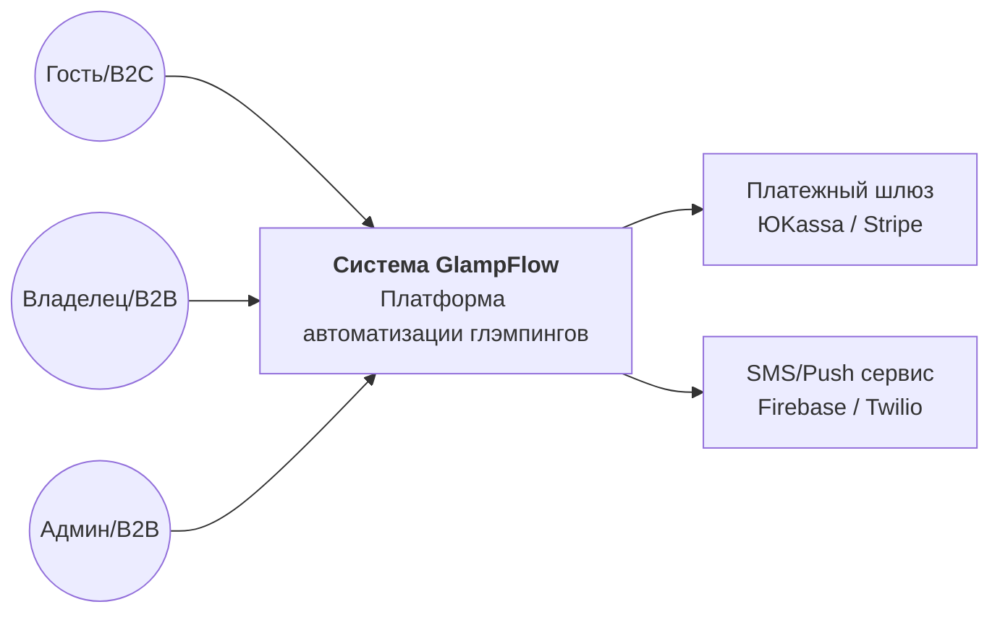
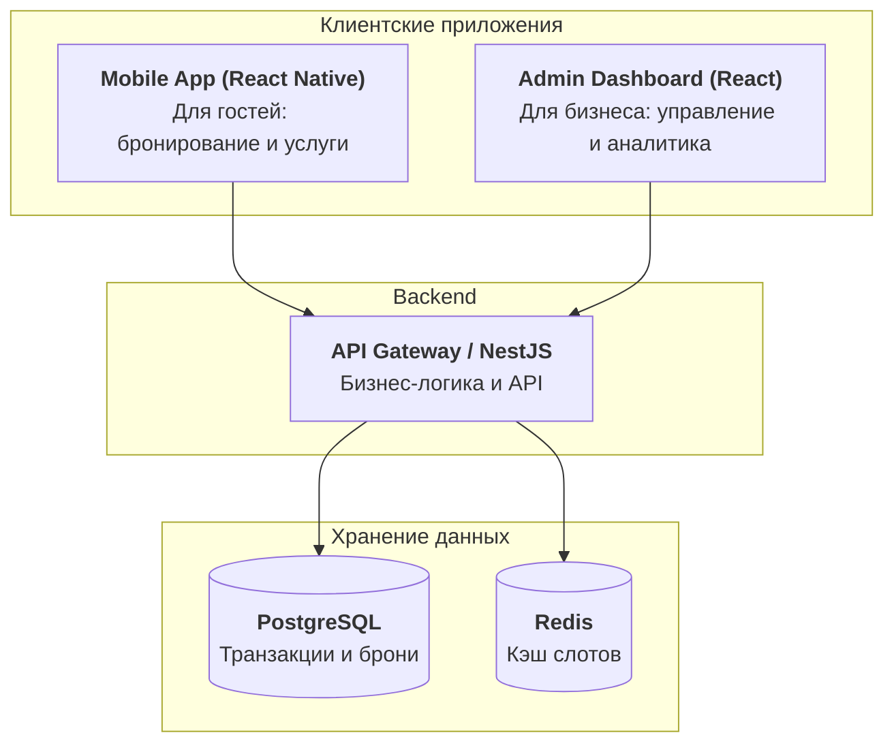

# 2026-VK-EDU-Management-Gorodov-E
# GlampFlow — B2B2C платформа для автоматизации глэмпингов

### Elevator Pitch
Для владельцев глэмпингов и эко-отелей, которые стремятся снизить зависимость от крупных агрегаторов и увеличить доход, наш продукт — это платформа, которая позволяет за 24 часа запустить собственное брендированное приложение для прямого бронирования и продажи дополнительных услуг. В отличие от стандартных CRM, мы фокусируемся на увеличении среднего чека через автоматизацию сервиса и апсейл внутренних услуг отеля.

### Lean Canvas
| Блок | Описание |
| :--- | :--- |
| **Проблема** | Высокие комиссии OTA (Booking/Ostrovok), отсутствие прямой связи с гостем, ручное управление доп.услугами. |
| **Сегменты клиентов** | **B2B:** Владельцы глэмпингов. **B2C:** Эко-туристы, ценящие комфорт. |
| **Уникальное ТП** | Свой брендированный сервис «как в 5* отеле» за подписку, увеличивающий доход на 20%. |
| **Решение** | Конструктор мобильного приложения + панель управления + система онлайн-оплаты. |
| **Каналы** | Прямые продажи, профильные конференции (Russian Woods), SEO. |
| **Потоки выручки** | Ежемесячная подписка (SaaS) + комиссия 2% с продаж внутренних услуг. |
| **Структура расходов** | Разработка (React Native/Node.js), поддержка серверов, маркетинг. |
| **Ключевые метрики** | LTV бизнеса, количество транзакций, средний чек гостя. |
| **Скрытое преимущество** | Готовые интеграции с умными замками и локальными фермерами. |

### Роли
* **Гость (B2C)**: Конечный пользователь, который ищет отдых и пользуется услугами глэмпинга.
* **Администратор (Сотрудник B2B)**: Линейный персонал, обрабатывающий заказы и обслуживающий гостей.
* **Владелец (B2B)**: Лицо, принимающее решения, анализирующее прибыль и настраивающее платформу.

### Список User Stories (Основной путь пользователя)

#### Для Гостя (B2C)
1. **Как гость**, я хочу видеть актуальный календарь свободных дат, чтобы выбрать подходящее время для поездки.
2. **Как гость**, я хочу просматривать детальные фотографии и описание вариантов размещения, чтобы быть уверенным в своем выборе.
3. **Как гость**, я хочу оплатить бронирование онлайн картой, чтобы мгновенно зарезервировать место.
4. **Как гость**, я хочу получить автоматическое подтверждение брони на email или в мессенджер, чтобы иметь гарантии поездки.
5. **Как гость**, я хочу просматривать каталог дополнительных услуг (баня, экскурсии, питание), чтобы заранее спланировать досуг.
6. **Как гость**, я хочу оформить заказ еды в палатку через приложение, чтобы не идти к администратору лично.
7. **Как гость**, я хочу видеть статус своего заказа в реальном времени, чтобы понимать, когда услуга будет оказана.
8. **Как гость**, я хочу получать push-уведомления о времени заезда и выезда, чтобы не пропустить важные тайминги.
9. **Как гость**, я хочу иметь возможность отменить бронь через личный кабинет (согласно правилам), чтобы быстро вернуть средства.
10. **Как гость**, я хочу оставить отзыв после проживания, чтобы поделиться впечатлениями и помочь другим туристам.

#### Для Администратора (B2B)
11. **Как администратор**, я хочу видеть общую шахматку бронирований, чтобы быстро ориентироваться в загрузке глэмпинга.
12. **Как администратор**, я хочу получать мгновенные уведомления о новых заказах услуг, чтобы оперативно приступать к их выполнению.
13. **Как администратор**, я хочу менять статус заказа (например, "Готовится" -> "Доставлено"), чтобы информировать гостя.
14. **Как администратор**, я хочу иметь возможность быстро связаться с гостем через чат приложения, чтобы уточнить детали заказа.
15. **Как администратор**, я хочу отмечать факт заезда (Check-in) и выезда (Check-out) гостя, чтобы поддерживать актуальность данных.

#### Для Владельца (B2B)
16. **Как владелец**, я хочу устанавливать гибкие цены в зависимости от дня недели или сезона, чтобы максимизировать прибыль.
17. **Как владелец**, я хочу видеть аналитический отчет по самым популярным доп. услугам, чтобы оптимизировать ассортимент.
18. **Как владелец**, я хочу настраивать брендинг приложения (логотип, цвета), чтобы повышать узнаваемость моего бизнеса.
19. **Как владелец**, я хочу управлять правами доступа сотрудников, чтобы обеспечить безопасность данных компании.
20. **Как владелец**, я хочу видеть финансовый отчет по выручке за месяц, чтобы оценивать эффективность бизнеса.

### Приоритезация функционала (RICE)

Оценка проводится по шкале: Reach (охват), Impact (влияние), Confidence (уверенность), Effort (затраты в человеко-месяцах). 
*Формула: Score = (Reach * Impact * Confidence) / Effort*

| Фича | Reach | Impact | Confidence | Effort | Score | Приоритет |
| :--- | :---: | :---: | :---: | :---: | :---: | :--- |
| **Поиск и бронирование дат** | 1000 | 3 | 100% | 2 | **1500** | Must Have |
| **Система онлайн-оплаты** | 1000 | 3 | 90% | 3 | **900** | Must Have |
| **Панель админа (заказы)** | 100 | 3 | 100% | 2 | **150** | Must Have |
| **Каталог доп. услуг** | 800 | 2 | 80% | 2 | **640** | Should Have |
| **Push-уведомления** | 900 | 1 | 70% | 1.5 | **420** | Should Have |
| **Личный кабинет (B2B)** | 50 | 3 | 80% | 4 | **30** | Could Have |

---

### Сформированные MVP и MLP
* **MVP (Скелет):** Веб-виджет для гостя (поиск дат, выбор домика, оплата) и базовая панель администратора для управления статусами бронирования.
* **MLP (Wow-эффект):** Мобильное приложение гостя с push-напоминаниями, чатом и возможностью заказать завтрак или баню в один клик.

---

### Детализация требований (Top-2 User Stories)

#### 1. История: Бронирование проживания (Гость)
* **Функциональные требования (ФТ):**
    1. Система должна отображать только доступные для бронирования объекты на выбранные даты.
    2. При нажатии «Оплатить» система должна блокировать выбранные даты на 15 минут до завершения транзакции.
* **Нефункциональные требования (НФТ):**
    1. Время отклика системы при поиске свободных дат не должно превышать 1.5 секунды.
    2. Интерфейс бронирования должен быть адаптивным (Mobile-first).

#### 2. История: Управление заказами (Администратор)
* **Функциональные требования (ФТ):**
    1. Система должна предоставлять интерфейс «Шахматка» для визуального контроля загрузки.
    2. Администратор должен иметь возможность вручную создать бронь для входящих звонков.
* **Нефункциональные требования (НФТ):**
    1. Синхронизация статусов между приложением гостя и панелью админа должна происходить в режиме реального времени (через WebSocket).
    2. Доступ к финансовым данным в панели должен быть ограничен ролью «Владелец».
 
### 1. Domain-Driven Design (DDD)
Разделение системы на функциональные зоны для обеспечения модульности.

* **Zone: Booking & Inventory (Бронирование и Инвентарь)**
    * **Описание:** Управление номерным фондом, календарем доступности и статусами домиков.
    * **Глоссарий:** Слот (доступный интервал), Овербукинг (двойное бронирование), Шахматка (визуальный календарь).
* **Zone: Marketplace Services (Дополнительные услуги)**
    * **Описание:** Управление каталогом услуг (еда, прокат, баня) и их жизненным циклом.
    * **Глоссарий:** Апсейл (допродажа), Прейскурант, Поставщик услуги.
* **Zone: Payments & Transactions (Финансы)**
    * **Описание:** Обработка платежей, расчет комиссий платформы и выплат владельцам глэмпингов.
    * **Глоссарий:** Эквайринг, Транзакция, Холдирование (заморозка средств).
* **Zone: User Profile & Identity (Пользователи)**
    * **Описание:** Управление ролями (B2B/B2C), авторизация и хранение персональных данных.
    * **Глоссарий:** RBAC (доступ на основе ролей), JWT-токен.
* **Zone: Notifications (Уведомления)**
    * **Описание:** Система доставки Push, Email и SMS уведомлений о событиях в системе.

### 2. Behavior-Driven Development (BDD)
**Критический путь:** Процесс бронирования домика гостем.

* **Сценарий 1: Успешное бронирование**
    * **Дано:** Гость выбрал свободные даты и нажал кнопку «Забронировать».
    * **Когда:** Платеж успешно обработан банком-эквайером.
    * **Тогда:** Система меняет статус слота на «Занято», отправляет подтверждение гостю и уведомление администратору.
* **Сценарий 2: Отказ из-за нехватки средств**
    * **Дано:** Гость выбрал свободные даты и перешел к оплате.
    * **Когда:** Банк отклонил транзакцию из-за недостаточного баланса.
    * **Тогда:** Система возвращает гостя на экран оплаты с ошибкой, при этом слот остается заблокированным еще на 5 минут.

### 3. Wireframes (Структурные схемы)
*Представьте интерфейс в виде следующих блоков:*
1.  **Экран поиска:** Строка выбора дат, фильтры «Удобства», список карточек глэмпингов.
2.  **Карточка объекта:** Фото-галерея, описание, кнопка выбора типа проживания, итоговая цена.
3.  **Экран оплаты:** Список выбранных услуг, поле для данных карты, кнопка «Оплатить [Сумма]».
4.  **Панель администратора:** Таблица со столбцами (Гость, Объект, Даты, Статус оплаты, Действия).

### 4. API-First (JSON контракты)

**Метод: GET /api/v1/booking/availability**
*Описание: Получение списка свободных слотов на выбранные даты.*
```json
// Request
{
  "glamping_id": "uuid-123",
  "start_date": "2026-06-10",
  "end_date": "2026-06-15"
}

// Response (Success)
{
  "available_units": [
    {
      "id": "tent-01",
      "type": "Safari-tent",
      "price_per_night": 5000,
      "total_price": 25000
    }
  ]
}
```
Метод: POST /api/v1/orders/service-order
Описание: заказ дополнительной услуги гостем во время проживания.
```json
// Request
{
  "booking_id": "uuid-999",
  "service_id": "breakfast-standard",
  "quantity": 2,
  "comment": "Без глютена"
}

// Response (Created)
{
  "order_id": "ord-555",
  "status": "pending",
  "estimated_delivery": "2026-06-11T09:00:00Z"
}
```
**### 1. Архитектурные схемы (C4 Model)

#### Уровень 1: Системный контекст (Context)
Определяет взаимодействие системы GlampFlow с внешним миром.


####Уровень 2: Контейнеры (Containers)
Описывает внутренние технические компоненты системы.

**

### 1. Hiring Plan (Команда проекта)
Для реализации MVP GlampFlow нам потребуется компактная кросс-функциональная команда:

* **Product Manager (1 человек)**
    * Отвечает за приоритизацию бэклога и соответствие продукта потребностям владельцев глэмпингов.
    * Проектирует путь пользователя и собирает обратную связь от первых B2B-клиентов.
* **Backend Developer (Node.js/NestJS) (1 человек)**
    * Реализует бизнес-логику бронирования, интеграцию с платежными шлюзами и безопасность данных.
    * Проектирует и поддерживает API для мобильного и веб-приложения.
* **Mobile/Frontend Developer (React Native/React) (1 человек)**
    * Разрабатывает кроссплатформенное мобильное приложение для гостей и веб-интерфейс для администраторов.
    * Обеспечивает высокую скорость работы интерфейса и адаптивность под разные устройства.
* **UI/UX Designer (Part-time/Outsource) (1 человек)**
    * Создает дизайн-систему проекта и проектирует интерфейсы для всех ролей (Гость, Админ, Владелец).
* **QA Engineer (1 человек)**
    * Проводит ручное и автоматизированное тестирование критических сценариев (оплата, бронирование).

---

### 2. Development Framework (Методология)
Для разработки GlampFlow выбрана методология **Scrum**.

**Почему именно Scrum?**:
* **Итеративность:** В B2B2C важно быстро выпускать обновления. Спринты по 2 недели позволяют оперативно внедрять фидбек от владельцев глэмпингов.
* **Прозрачность:** Четкие цели спринта и демонстрации продукта (Demo) помогают стейкхолдерам видеть прогресс на ранних этапах.
* **Гибкость:** Мы можем менять приоритеты в бэклоге между спринтами, если рынок потребует новых функций (например, быструю интеграцию с новыми картами).

---

### 3. Team Rituals (Командные ритуалы)
Для синхронизации команды и контроля качества процесса установлены следующие встречи:

| Ритуал | Частота | Цель |
| :--- | :--- | :--- |
| **Daily Standup** | Ежедневно (15 мин) | Синхронизация по задачам на день, выявление блокирующих факторов. |
| **Sprint Planning** | Раз в 2 недели | Формирование цели спринта и выбор задач из бэклога для реализации. |
| **Sprint Review (Demo)** | Раз в 2 недели | Демонстрация готового функционала стейкхолдерам и сбор обратной связи. |
| **Sprint Retrospective** | Раз в 2 недели | Обсуждение внутренних процессов команды и поиск способов их улучшения. |
| **Backlog Grooming** | Раз в неделю | Уточнение и декомпозиция задач в бэклоге перед следующим планированием. |

Для успешного запуска B2B2C платформы необходимо предусмотреть возможные угрозы и подготовить план действий.

| Риск | Тип | Уровень | Стратегия реагирования |
| :--- | :--- | :--- | :--- |
| **Технический сбой: овербукинг** (ошибка в логике, приведшая к двойному бронированию). | Внутренний | **Высокий** | **Минимизация:** Использование ACID-транзакций в PostgreSQL и блокировок (Redis) на этапе оплаты. |
| **Низкий темп привлечения B2B-клиентов** (владельцы глэмпингов не хотят переходить на новую систему). | Внешний | **Средний** | **Минимизация:** Запуск бесплатного пробного периода (Trial) и упрощенный импорт данных из текущих систем. |
| **Изменение законодательства** (ужесточение правил хранения персональных данных или налогообложения). | Внешний | **Средний** | **Принятие/Адаптация:** Регулярный аудит архитектуры на соответствие ФЗ-152 и гибкая настройка налоговых ставок. |
| **Отказ платежного шлюза** (невозможность принимать оплату от гостей). | Внешний | **Высокий** | **Минимизация:** Интеграция с двумя независимыми платежными провайдерами для быстрого переключения. |
| **Уход ключевого разработчика** (потеря знаний о сложной архитектуре). | Внутренний | **Средний** | **Минимизация:** Ведение актуальной технической документации в Confluence/GitHub и практика Code Review. |
| **Утечка данных пользователей** (угроза кибербезопасности). | Внутренний | **Высокий** | **Минимизация:** Шифрование данных, использование JWT с коротким временем жизни и регулярное тестирование на проникновение. |

